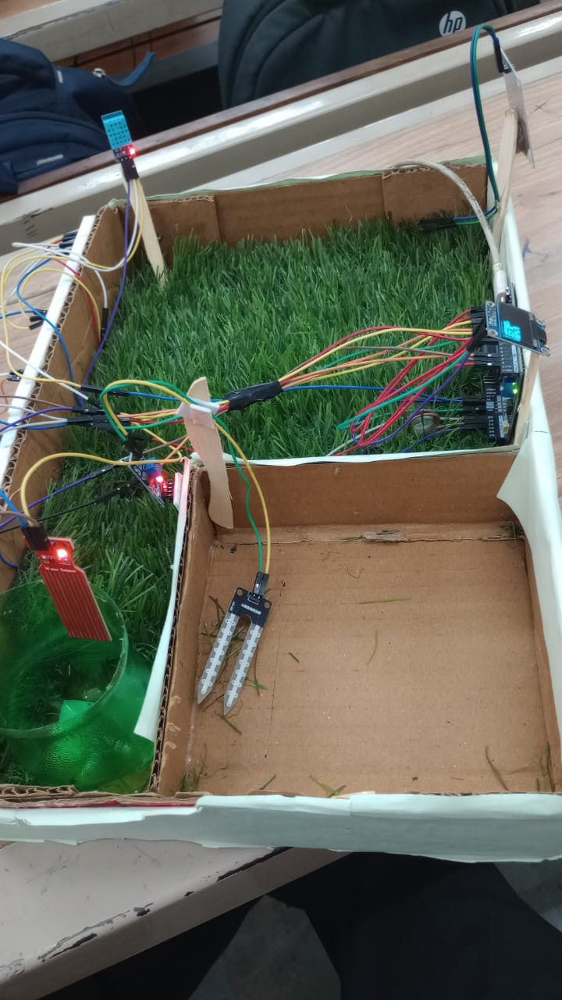
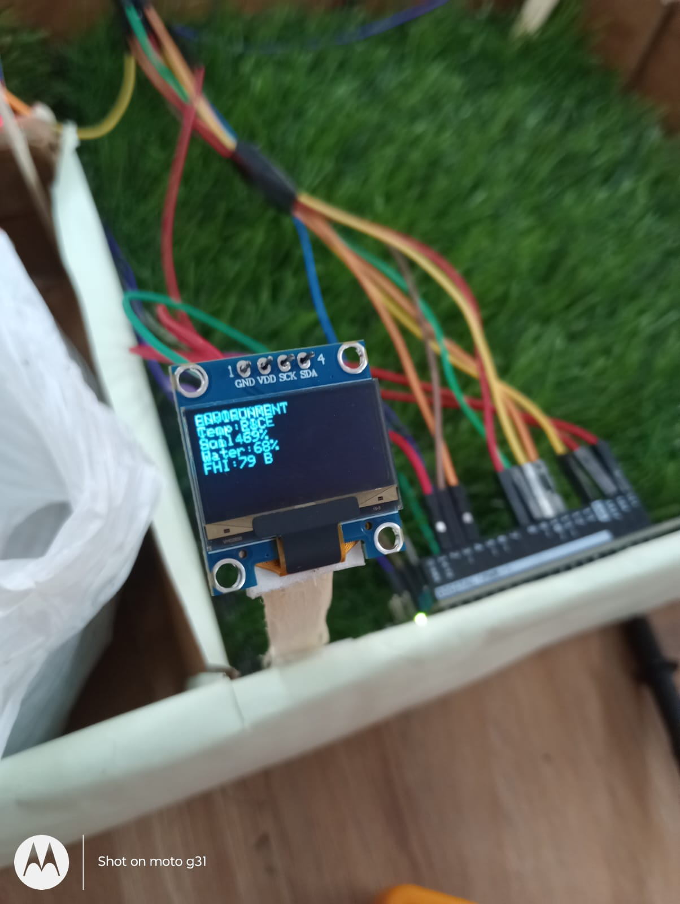
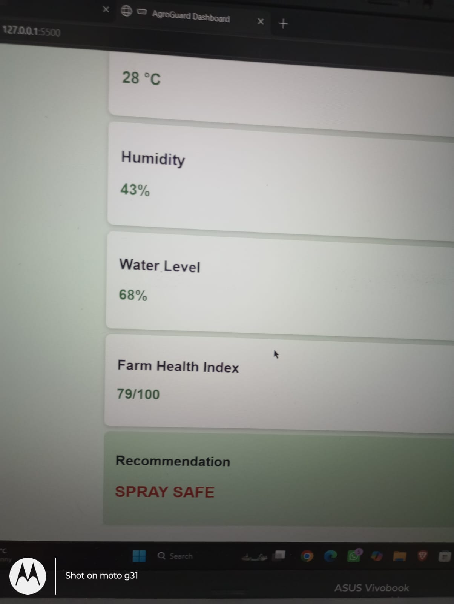

# 🌱 AgroGuard - Smart Farm Decision Assistant

> An Arduino-based smart agriculture system for real-time farm monitoring, crop recommendation, and intelligent decision-making.

## 📖 Overview

AgroGuard is a smart farming prototype developed to help farmers monitor field conditions and make informed decisions regarding irrigation, crop suitability, and pesticide spraying.

The project integrates multiple sensors with Arduino to analyze environmental conditions and provides live recommendations through an OLED display. AgroGuard was successfully demonstrated at my college exhibition and received appreciation from the Head of the Department (HOD).

✨ Features

* 🌱 Soil Moisture Monitoring
* 🌧 Rain Detection
* 💧 Water Tank Level Monitoring
* 🌡 Temperature Monitoring (DHT11)
* 💨 Humidity Monitoring
* 🌾 Crop Selection System
* 📊 Farm Health Index (FHI)
* 🌿 Crop Suitability Analysis
* 🌱 Suggested Crop Recommendation
* ☁ Weather Status Detection
* 🚫 Intelligent Spray Recommendation
* 📟 OLED Display Interface
* 💡 LED Status Indicators
* 🌐 HTML Dashboard (Prototype)

 🛠 Hardware Components

* Arduino UNO R4 WiFi
* DHT11 Sensor
* Soil Moisture Sensor
* Rain Sensor
* Water Level Sensor
* OLED Display (128×64 I2C)
* Push Buttons
* LEDs
* Breadboard
* Jumper Wires
* USB Cable

💻 Software Used

* Arduino IDE
* HTML
* CSS
* JavaScript
* Git & GitHub

⚙ Working Principle

1. Read data from all sensors.
2. Calculate Soil Moisture, Water Level, Temperature and Humidity.
3. Detect rain conditions.
4. Calculate Farm Health Index (FHI).
5. Analyze crop suitability.
6. Suggest the most suitable crop.
7. Recommend whether pesticide spraying is safe.
8. Display results on the OLED screen.
9. Send sensor data through Serial for the HTML dashboard.

 📊 Farm Health Index (FHI)

The Farm Health Index is calculated using:

* Soil Moisture
* Water Availability
* Temperature
* Humidity

Based on the score, the farm is graded as:

| FHI      | Grade |
| -------- | ----- |
| 90+      | A+    |
| 80-89    | A     |
| 70-79    | B     |
| 60-69    | C     |
| Below 60 | D     |

 🚦 LED Indicators

🟢 Green → Spray Safe

🟡 Yellow → Avoid Spray

🔴 Red → Do Not Spray

🌾 Crop Selection

Supported Crops:

* Wheat
* Rice
* Sugarcane
* Potato

The system also recommends an alternative crop when current conditions are not ideal.

🚀 Future Scope

* IoT Cloud Dashboard
* Mobile Application
* Automatic Irrigation
* Weather API Integration
* AI-based Crop Disease Detection
* Fertilizer Recommendation
* Remote Monitoring

 Exhibition

This project was successfully demonstrated during my college exhibition, where it received appreciation from the Head of the Department (HOD) for its practical application in smart agriculture.
📸 Project Images

### Final Model

### OLED Display

### Top View

### Live Dashboard

 👨‍💻 Author

**Kunal Sharma**

B.Tech – Computer Science & Engineering

Passionate about Arduino, IoT, Embedded Systems and AI

